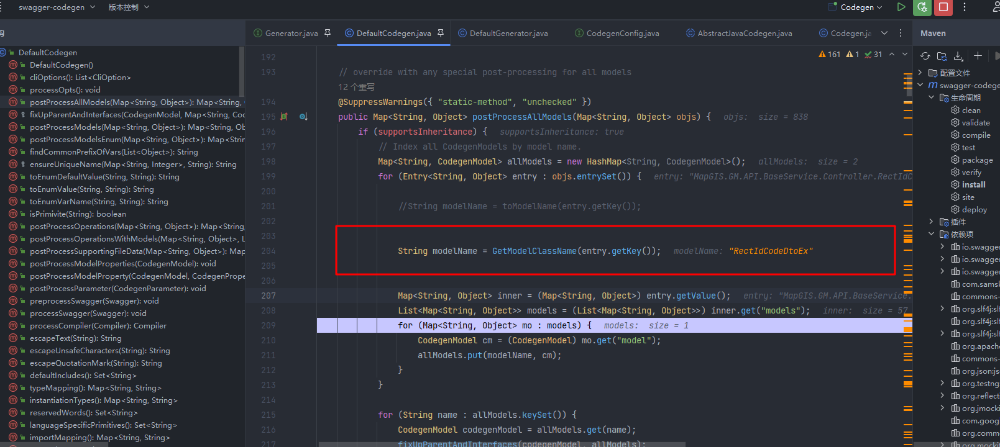

# day 2023-07-24

==任务==

- [x] 目录树添加自定义专题节点名优化
- [x] [门户系统启动报错、公众系统启动失败。](http://192.168.182.112:8091/zentao/bug-view-11385.html)
- [x] [bug]10977 **【元数据管理】先字段筛选后点击搜索栏“清空”按钮，再取消筛选，tab页卡住**
- [x] 11023 **【自动进入上次打开的工程】在点击确定按钮后，此设置项才生效**
- [x] [bug]【数据备份】备份过程中存在错误时，未终止备份](http://192.168.182.112:8091/zentao/bug-view-10681.html)
- [x] [【数据还原】还原失败](http://192.168.182.112:8091/zentao/bug-view-10677.html)
- [x] 日志组件sqllite报错
- [x] 11373 **【数据库升级】按钮排版优化**

- [ ] **java 二次开发sdk规范生成的responsemodel名称**


## 关键代码

java sdk




## tips

### lazy

```
   private readonly Lazy<LoginCfgParser> _parser = new Lazy<LoginCfgParser>(() => new LoginCfgParser());
   
   
```


