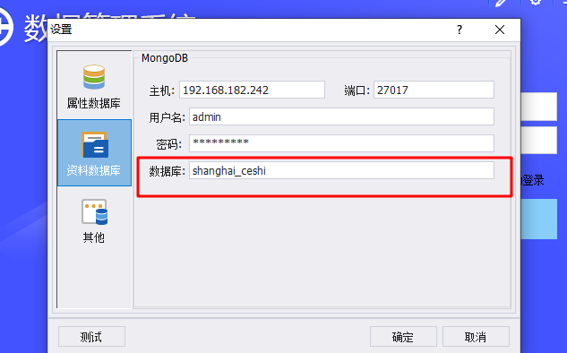
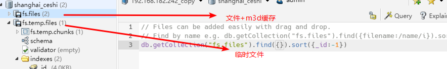

# 2023-07-27


- [x] 针对文件存储优化.临时文件和文件采用一个mongo库,根据不同bucketname区分
- [x] 11401 **门户系统-数据目录无法根据相应地市显示对应数据**
- [x] 20165 **【优化—数据备份】功能触发位置调整**


## 发布m3d临时服务到gms

MapGIS.GM.BaseService.dll 新增一组发布m3d临时服务接口

IMapGISServicePublishService 新增PublishTempM3D2Server  用于发布m3d临时服务

```

        ActionResult<WebPublishServiceInfoDto> PublishTempM3D2Server(GMDomainServiceLayerTypeAttribute serviceLayerTypeAttribute,
            string serverName, string mcjFilePath);


        ActionResult<WebPublishServiceInfoDto> PublishTempM3D2Server<T>(string serviceLayerTypeId, string serverName, string mcjFilePath, T attachInfo) where T : class;


        ActionResult<WebPublishServiceInfoDto> PublishTempM3D2Server<T>(GMDomainServiceLayerTypeAttribute serviceLayerTypeAttribute,
            string serverName, string mcjFilePath, T attachInfo) where T : class;

```

使用方法

```
    var svc = DataWorksRuntime.Instance.GetService<IMapGISServicePublishService>();
    svc.PublishTempM3D2Server<object>(GMServiceLayerTypeDefine.IgsGmM3dPipeLayer, serviceName, mcjPath, null);
```


创建mongo用户

```
use shanghai_ceshi

db.createUser(
    {
        user:"admin",
        pwd:"admin@123",
        roles:[
            {role:"dbOwner", db:"shanghai_ceshi"}
        ]
    }
)


```


收获:

mongo的备份还原:

https://gitee.com/fengqixi_358/mongo-dbmanager/tree/master

pgsql的备份还原:


notion笔记备份库:

https://gitee.com/haipihuang/notion_backup_helper_tool?_from=gitee_search


清理mongo文件

```
csharp
using MongoDB.Bson;
using MongoDB.Driver;
using MongoDB.Driver.GridFS;
using System;
 public class GridFSCleanup
{
    private const string ConnectionString = "mongodb://localhost:27017";
    private const string DatabaseName = "your_database_name";
    private const string FilesCollectionName = "fs.files";
    private const string ChunksCollectionName = "fs.chunks";
    private const string PrefixToRemove = "B93172e25f5e9498287cc08828947b253";
     public void CleanupFiles()
    {
        var client = new MongoClient(ConnectionString);
        var database = client.GetDatabase(DatabaseName);
        var filesCollection = database.GetCollection<BsonDocument>(FilesCollectionName);
        var chunksCollection = database.GetCollection<BsonDocument>(ChunksCollectionName);
         var filter = Builders<BsonDocument>.Filter.Regex("filename", new BsonRegularExpression($"^{PrefixToRemove}"));
        var filesToDelete = filesCollection.Find(filter).ToList();
         foreach (var file in filesToDelete)
        {
            var fileId = file["_id"].AsObjectId;
            chunksCollection.DeleteMany(Builders<BsonDocument>.Filter.Eq("files_id", fileId));
            filesCollection.DeleteOne(Builders<BsonDocument>.Filter.Eq("_id", fileId));
        }
         Console.WriteLine($"Deleted {filesToDelete.Count} files.");
    }
}
```


## Tip1

```


   UserInfo userInfo = securityUtil.getCurUserInfo();
        if (userInfo!=null){
            System.out.printf("方式1获取用户:"+userInfo.getUsername() +","+userInfo.getUnit()+"当前city:"+userInfo.getCityName()+"\r\n");
        }

        if (param.getDistrict() != null) {
            condition.append(String.format("%s=\"%s\"", CommonFunc.OwnerFieldString, param.getDistrict().getCityName()));
        }

        if (userInfo != null && userInfo.getCityName() != null && !userInfo.getCityName().equals("广东省")) {
            if (condition.length() > 0) {
                condition.append(String.format("and ( %s='%s' ) ", CommonFunc.OwnerFieldString, userInfo.getCityName()));
            }else{
                condition.append(String.format("%s=\"%s\"", CommonFunc.OwnerFieldString, userInfo.getCityName()));
            }
        }

        System.out.printf("当前过滤条件:"+condition.toString()+"\r\n");
```


## TIP2

针对文件存储做了调整,文件和临时文件均放置一个库.之前放2个库





