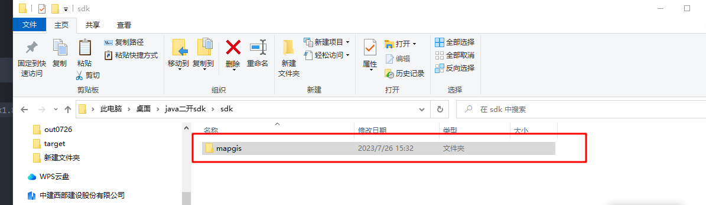
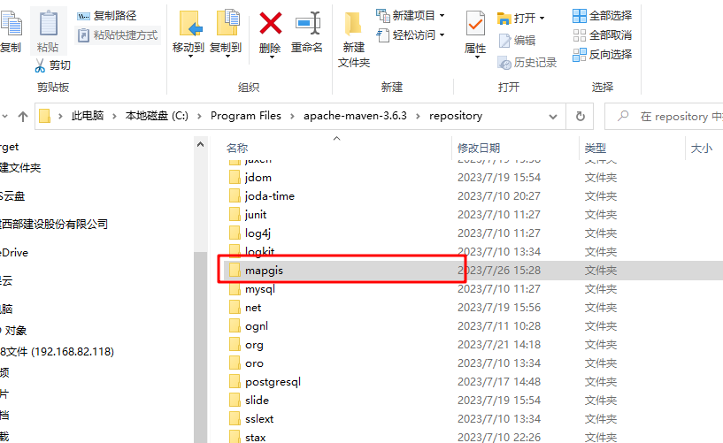
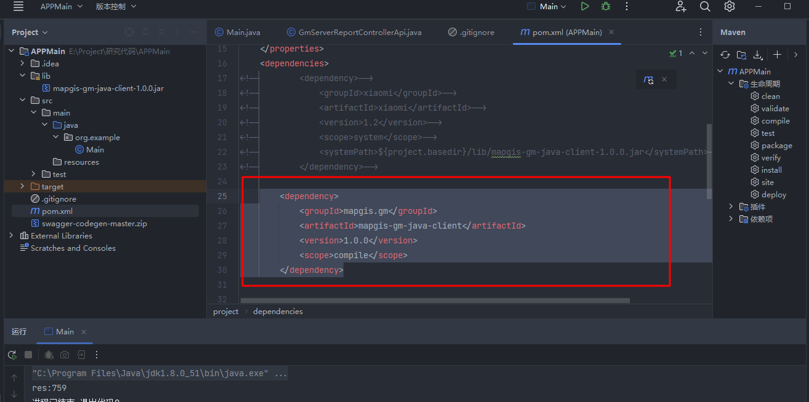

#  java 二次开发api sdk使用说明


## 安装




将sdk包拷贝到本地maven仓库

C:\Program Files\apache-maven-3.6.3\repository




## Maven使用

pom.xml文件中加入

```java
    <dependency>
            <groupId>mapgis.gm</groupId>
            <artifactId>mapgis-gm-java-client</artifactId>
            <version>1.0.0</version>
            <scope>compile</scope>
        </dependency>
```




## 示例代码


```java


public class Main {
    public static void main(String[] args) {


        GmServerReportControllerApi api = new GmServerReportControllerApi();

        //配置api基地址 比如 http://192.168.182.240:7003
        api.getApiClient().setBasePath("http://192.168.182.240:7003");

        //调用api接口方法
        MapGISGMApworksActionResultSystemInt64 res = api.GetTotalApiCount();

        System.out.printf("res:"+res.getObj().toString());


    }


}
```


