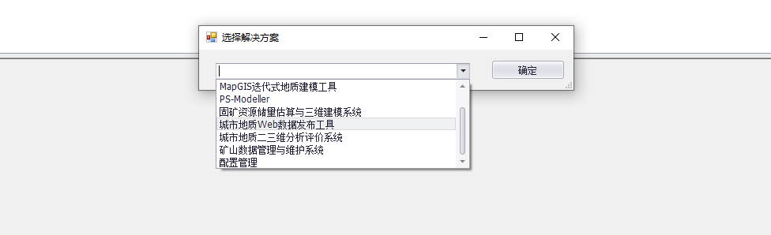

# 服务发布mongo改本地配置存储


## 配置mongo存储的位置


配置mongo的方法

1.通过配置工具修改





2.通过登录配置改


3.通过服务发布配置改


## 需要更新的库


### .net windows平台

```
MapGIS.GM.DataWorks.Core
MapGIS.GM.WebDataPublish

```


### .net core linux 

```
MapGIS.GMCore.DataWorks.Core
MapGIS.GMCore.WebDataPublish
```


